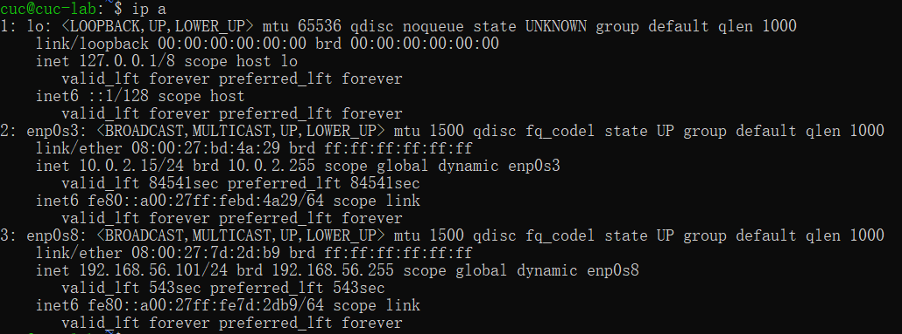
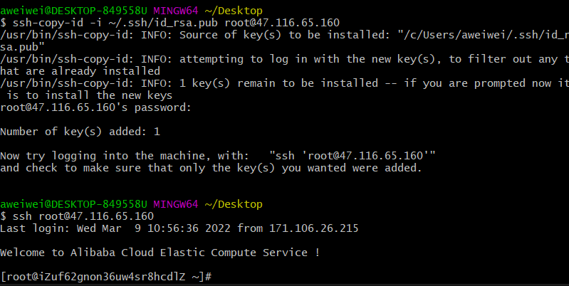

# 主流Linux发行版初体验：本地实验环境和云实验环境

## 实验目的

- 初步了解本地实验环境与阿里云实验环境的异同
- 了解查询当前所用Linux发行版本及内核版本的方法
- 了解如何通过netplan配置网卡信息
- 了解在虚拟机和宿主机之间、本机和远程 Linux 系统之间传输文件的方法
- 了解如何配置 SSH 免密登录

## 实验环境

- Ubuntu 20.04.02 Server 64bit
- 本地环境
  - Virtualbox 6.1.16
- [阿里云 云起实验室 提供的【零门槛云上实践平台】](https://developer.aliyun.com/adc/)
  - [Linux指令入门-文件与权限](https://developer.aliyun.com/adc/scenario/exp/a12055b0e9e84e5692b05ae25d377ec0)

## 实验要求

### 1. 调查并记录实验环境的如下信息：

#### 1.1 当前 Linux 发行版基本信息


```shell
# 方法一：cat查看文本文件内容
# release文件通常呗视为操作系统的标识
cat /etc/issue 
cat /etc/os-release
cat /etc/*release*

# 方法二：less可随意浏览文件，支持翻页和搜索，支持向上翻页和向下翻页
less /etc/os-release

# 方法三：通过LSB（Linux标准库）可以打印发行版的具体信息，包括发行版名称、版本号、代号等
lsb_release -a

# ls 列出所有文件
ls /etc/*release*
```

- 本地环境实验截图：


- 云环境实验截图：


- 本地环境与云环境中的区别：

  - 在本地环境中可以使用 cat /etc/issue  命令查找到发行版本，即可以在etc目录下找到issue文件；而在云环境中无法找到该文件。

  - 在通过 ls /etc/\*release* 命令查找etc目录下所有名称含有release的文件或目录时，发现在云环境中的文件或目录比本地环境多，但两个环境中都有os-release文件。

  - 本地环境使用的是Ubuntu 20.04.2 LTS发行版本，云环境使用的是CentOS Linux release 7.7.1908 (Core) 版本。


#### 1.2 当前 Linux 内核版本信息

```shell
# 方法一 
cat /proc/version

# 方法二 uname(unix name) 打印系统信息的工具，包括内核名称、版本号、系统详细信息以及所运行的操作系统等
uname -a
```

- 本地环境实验截图：


- 云环境实验截图：


- 本地环境与云环境中的区别：

  - 本地环境的linux内核版本为：Linux version 5.4.0-65-generic (buildd@lcy01-amd64-018) (gcc version 9.3.0 (Ubuntu 9.3.0-17ubuntu1~20.04))

  - 云环境的linux内核版本为：Linux version 3.10.0-1062.18.1.el7.x86_64 (mockbuild@kbuilder.bsys.centos.org) (gcc version 4.8.5 20150623 (Red Hat 4.8.5-39) (GCC))


### 2. Virtualbox 安装完 Ubuntu 之后新添加的网卡如何实现系统开机自动启用和自动获取 IP？

- 第一步，查看当前网卡使用情况：

```shell
ip a
```



- 第二步，修改配置文件并应用

```shell
ls /etc/netplan # 查看配置文件名称
cat /etc/netplan/*.yaml # 查看该文件内容,其中dhcp表示启用自动获取ip
vim /etc/netplan/01-netcfg.yaml # 通过vim编辑器对文件进行修改
netplan apply # 应用文件
```


- 第三步，再次查询网卡状态，并获取ip


**注：**由于版本的不同，在云环境中没有目录netplan，故不在云环境中做该实验。


### 3. 如何使用 `scp` 在「虚拟机和宿主机之间」、「本机和远程 Linux 系统之间」传输文件？

- scp命令解释：scp 命令用于 Linux 之间复制文件和目录。scp 是 secure copy 的缩写, scp 是 linux 系统下基于 ssh 登陆进行安全的远程文件拷贝命令。

- **scp使用格式：**

  - ```shell
    #空格隔开两个参数
    scp [OPTION] [user@]SRC_HOST:]file1 [user@]DEST_HOST:]file2
    ```
    
  - `OPTION` - [scp options](https://linux.die.net/man/1/scp) such as cipher, ssh configuration, ssh port, limit, recursive copy …etc.
  
  - `[user@]SRC_HOST:]file1` - Source file.
  
  - `[user@]DEST_HOST:]file2` - Destination file
  
- 创建test文件

```shell
#touch命令用于修改文件或者目录的时间属性，包括存取时间和更改时间。若文件不存在，系统会建立一个新的文件
touch [-acfm][-d<日期时间>][-r<参考文件或目录>] [-t<日期时间>][--help][--version][文件或目录…]

#显示档案的时间记录
ls -l 

#print work directory 命令用于显示工作目录
pwd

#在文件中写入内容
echo "hello linux" > test

#查找scp所在目录
which scp
```

#### 3.1 使用scp在虚拟机和宿主机之间传输文件 

- 创建test文件


- 使用scp将虚拟环境中的test文件传输到本地

```shell
 scp cuc@192.168.56.101:/home/cuc/test ./
```


#### 3.2 使用scp在本机和远程Linux系统之间传输文件

- 创建test文件


- 使用scp将云环境中的test文件传输到本地

```shell
scp root@47.116.65.160:/root/test ./
```


### 4. 如何配置 SSH 免密登录？

- 生成公钥和私钥

```shell
#生成公私钥对 -b 指定生成密钥长度 -t 指定加密算法
ssh-keygen.exe -b 4096 -t rsa 

#查看公钥内容
cat ~/.ssh/id_rsa.pub
```

- 将 SSH 密钥添加到远程计算机

```
ssh-copy-id -i ~/.ssh/id_rsa.pub 用户名@ip地址
```

- 本地环境实验截图


- 云环境实验截图





## 遇到的问题与解决方案

- 在使用scp从虚拟机向宿主机之间传输文件时，直接在远程连接的虚拟机上使用scp命令，显示成功但找不到文件

  - 

  - 解决方案：从虚拟机向宿主机之间传输文件应该在本机上使用scp命令，并且要注意scp两个参数的位置与间隔

- 不理解网卡的配置过程导致第二道实验无从下手

  - 解决方案：在公开仓库中参考了一些同学的作业，并结合黄玮老师的网课内容及网上资料，初步理解了网卡的配置方法和vim编辑器的使用方法

## 参考资料

- [查看Linux系统版本-ywl925-博客园](https://www.cnblogs.com/ywl925/p/11083351.html)
- [ubuntu 20.04 通过netplan配置网络](https://www.linux.com/topic/distributions/how-use-netplan-network-configuration-tool-linux/)
- [How to Use the ssh-copy-id Command (linuxhint.com)](https://linuxhint.com/use-ssh-copy-id-command/#:~:text=SSH-copy-id Command Options 1 -i argument%3A This argument,to the remote host. ... More items... ])

