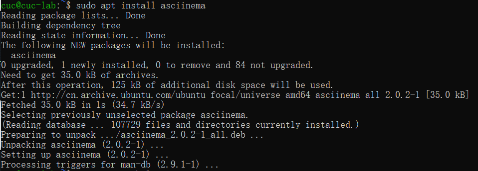
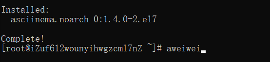
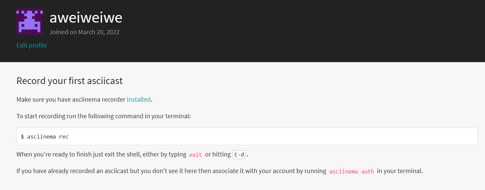

# Linux命令行使用基础：本地实验环境和云实验环境

## 实验目的

- 学会使用asciinema终端回放工具
- 了解软件包管理相关知识，并能熟练地安装或删除软件
- 了解文件管理
- 了解文件的压缩与解压缩
- 了解子进程的管理
- 学会获取硬件信息
- 对比本地环境和云环境中信息的获取方式

## 实验环境

- Ubuntu 20.04.02 Server 64bit
- 本地环境
  - Virtualbox 6.1.16
- 阿里云平台 CentOS 7.7
  - [Linux指令入门-文件与权限](https://developer.aliyun.com/adc/scenario/exp/a12055b0e9e84e5692b05ae25d377ec0)
- 在 [asciinema](https://asciinema.org/) 注册一个账号，并在本地安装配置好asciinema

## 实验要求

### 1. 配置asciinema

- asciinema 是Linux的一种终端回放工具，有类似于视频回放的效果

- asciinema 安装

  - **本地环境（Ubuntu20.04）中**

  ```shell
  sudo apt-add-repository ppa:zanchey/asciinema #获取最新的个人软件包档案源，将其添加至当前apt库中，并自动导入公钥
  sudo apt-get update
  sudo apt-get install asciinema
  sudo apt update && sudo apt install asciinema
  ```

  - **云环境（CentOS 7.7）中**

  ```shell
  sudo yum makecache #更新数据库
  sudo yum -y install asciinema #安装
  ```





- 确保本地已经完成**asciinema auth**，并在[asciinema](https://asciinema.org/)成功关联了本地账号和在线账号



### 2. 【软件包管理】在目标发行版上安装 `tmux` 和 `tshark` ；查看这 2 个软件被安装到哪些路径；卸载 `tshark` ；验证 `tshark` 卸载结果

- **在本地环境（Ubuntu20.04）中实现**

  - tmux的安装和查看安装路径

    ```shell
    sudo apt install tmux #安装tmux
    sudo apt-cache show tmux #查看安装包tmux当前安装路径
    ```

  [](https://asciinema.org/a/ST9enAf3HeogzF9cXP94WYGgI)

  - tshark的安装、卸载和路径查看

    ```shell
    sudo apt install tshark #安装tshark
    sudo apt-cache show tshark	#查看当前安装路径
    sudo apt remove --purge tshark #卸载tshark软件包
    ```

  [](https://asciinema.org/a/UNCz4nrGASgRhi6Zdc6pYZY3O)

- **在云环境（CentOS 7.7）中实现**

  - tmux的安装和查看安装路径

    ```shell
    yum install tmux #安装
    rpm -qal |grep tmux #查看路径
    ```

  - tshark的安装、卸载和查看情况

    ```shell
    yum install wireshark 	#在CentOS中并没有tshark这个包，而是Wireshark包已经包含了tshark包，因此只需安装Wireshark即可
    yum -y remove wireshark #卸载
    ```

  [](https://asciinema.org/a/7KpZXEO67Gk5qgURWjji8jQtr)

### 3.【文件管理】复制以下 `shell` 代码到终端运行，在目标 Linux 发行版系统中构造测试数据集，然后回答以下问题：

```shell
cd /tmp && for i in $(seq 0 1024);do dir="test-$RANDOM";mkdir "$dir";echo "$RANDOM" > "$dir/$dir-$RANDOM";done
```

#### 找到 `/tmp` 目录及其所有子目录下，文件名和文件内容中包含 `666` 的所有文件

- **在本地环境（Ubuntu20.04）中实现**

```shell
sudo find ./ -type f -name "*666*" #文件名
sudo grep -r "666" ./ --exclude=*.cast #文件内容
#通过"--exclude"排除 asciinema录制会在当前目录写入后缀为“.cast”文件而导致查找乱码的问题。
```

[](https://asciinema.org/a/wdYNiD2eH4hghPoVh4WmT7GnK)

- **在云环境（CentOS 7.7）中实现**

```shell
find / -name '*666*' #文件名
find . | xargs grep -ri '666' # 文件内容
```

[](https://asciinema.org/a/NP6HVrm6pv0Vr0ZULiymBY5Fo)

### 4. 【文件压缩与解压缩】练习课件中 [文件压缩与解压缩](https://c4pr1c3.github.io/LinuxSysAdmin/chap0x02.md.html#/12/1) 一节所有提到的压缩与解压缩命令的使用方法

- **在本地环境（Ubuntu20.04）中实现**

  - 将Windows主机上的test.zip文件拷贝到虚拟机上，并在虚拟机上查看文件是否已经成功上传

  ```shell
  scp C:/Users/aweiwei/Desktop/test.zip cuc@192.168.56.101:~/ # 拷贝到虚拟机上
  ls -l # 查看是否上传成功
  ```

  [](https://asciinema.org/a/iKSorMuXYO0n13bBpt1bSoo6h)

- **在云环境（CentOS 7.7）中实现**

  - 将Windows主机上的test.zip文件拷贝到虚拟机上，并在虚拟机上查看文件是否已经成功上传

  ```shell
  scp C:/Users/aweiwei/Desktop/test.zip root@101.133.167.218:~/
  ```

  [](https://asciinema.org/a/S4he9nLgvOIfp1cMNFcWtpBVQ)

### 5. 【跟练】 [子进程管理实验](https://asciinema.org/a/f3ux5ogwbxwo2q0wxxd0hmn54)

[](https://asciinema.org/a/Lig2ciTjE7xkHGHLk5GeuyyUR)

### 6. 【硬件信息获取】目标系统的 CPU、内存大小、硬盘数量与硬盘容量

- **在本地环境（Ubuntu20.04）中实现**

```shell
grep "model name" /proc/cpuinfo |awk -F ':' '{print $NF}' #型号
cat /proc/cpuinfo | grep "physical id" | uniq | wc -l #查看电脑处理器个数
cat /proc/cpuinfo | grep "cpu cores" | uniq # 查看电脑处理器核数
free -m #内存信息
sudo fdisk -l |grep "Disk /dev/sd" # 硬盘数量和大小
```

[](https://asciinema.org/a/gc4NUxw8rQgHBWSc5XvEfbfl7)

- **在云环境（CentOS 7.7）中实现**

```shell
cat /proc/cpuinfo | grep name | cut -f2 -d: | uniq -c # CentOS7查看CPU
free -m # 查看内存情况
df -hl # 查看磁盘剩余空间
df -h # 查看每个根路径的分区大小
```

[](https://asciinema.org/a/RKbiOz1YRslt3hASXmC3VXHJj)

### 总结Ubuntu和CentOs对以下信息的获取方式：

| 版本              | Ubuntu（20.04）                                              | CentOS（7.7）                                                |
| ----------------- | ------------------------------------------------------------ | ------------------------------------------------------------ |
| 安装应用          | `apt install`                                                | `yum install -y`                                             |
| 卸载应用          | `sudo apt-get --purge remove tshark`                         | `yum remove`                                                 |
| 查看安装路径      | `dpkg -L tmux`                                               | `rpm -qal | grep`                                            |
| 查找文件名        | `sudo find / -name '*666*'`                                  | `find / -name '*666*'`                                       |
| 查找文件内容      | `sudo grep -r '666'./ --exclude=*.cast`                      | `find . | xargs grep -ri '666'`                              |
| zip压缩与解压缩   | `unzip filename.zip`解压文件<br/>`zip filename`压缩文件      | `unzip filename.zip`解压文件<br/>`zip filename.zip filename`压缩文件 |
| gzip压缩与解压缩  | `gzip -d filename.gz`解压文件<br/>`gzip -d filename`压缩文件` | `gzip -d filename.gz`解压文件<br/>`gzip filename`压缩文件    |
| tar压缩与解压缩   | `tar -xvf filename.tar`解压文件<br/>`tar -cvf filename`打包文件 | `tar -xvf filename.tar`解压文件<br/>`tar -cvf filename.tar filename`打包文件 |
| bzip2压缩与解压缩 | `bzip2 -d filename.bz2` 解压文件<br/>`bzip2 -z filename` 压缩文件 | `bzip2 -d filename.bz2` 解压文件<br/>`bzip2 -z filename` 压缩文件｜ |
| 7z压缩与解压缩    | `7z x filename.7z` 解压文件<br/>`7z a filename.7z` 压缩文件  | `7za x filename.7z` 解压文件<br/>`7za a filename.7z` 压缩文件 |
| rar压缩与解压缩   | rar a` `rar x                                                | rar a` `rar x                                                |
| 硬件信息获取      | `cat /proc/cpuinfo |grep 'model name'`# 获取目标系统CPU `cat /proc/meminfo |grep MemTotal `#查看内存大小 `sudo fdisk -l |grep Disk`# 查看硬盘信息 | `grep 'model name'/proc/cpuinfo`# 获取目标系统CPU `grep MemTotal /proc/meminfo` # 获取内存大小 `fdisk -l |grep Disk` # 查看硬盘信息 |


## 遇到的问题与解决方案

- **sudo apt update无法正常执行**

当执行sudo apt update语句时出现如下报错：

```shell
Ign:1 http://ppa.launchpad.net/zanchey/asciinema/ubuntu focal InRelease
Hit:2 http://cn.archive.ubuntu.com/ubuntu focal InRelease
Hit:3 http://cn.archive.ubuntu.com/ubuntu focal-updates InRelease
Err:4 http://ppa.launchpad.net/zanchey/asciinema/ubuntu focal Release
  404  Not Found [IP: 91.189.95.85 80]
Hit:5 http://cn.archive.ubuntu.com/ubuntu focal-backports InRelease
Hit:6 http://cn.archive.ubuntu.com/ubuntu focal-security InRelease
Reading package lists... Done
E: The repository 'http://ppa.launchpad.net/zanchey/asciinema/ubuntu focal Release' does not have a Release file.
N: Updating from such a repository can't be done securely, and is therefore disabled by default.
N: See apt-secure(8) manpage for repository creation and user configuration details.
```

查找资料后发现：一些版本号对应的PPA不同

For example, the `ppa:mc3man/trusty-media` PPA is only for Trusty (Ubuntu 14.04) only (trusty-media). Obviously, it has no files for Xenial (16.04). You can check the [PPA's Launchpad page](https://launchpad.net/~mc3man/+archive/ubuntu/trusty-media) to see which versions of Ubuntu are supported.

因此首先将旧版本号的release文件删除（Remove the PPA for an older release）

```shell
sudo add-apt-repository --remove ppa:zanchey/asciinema
```

再重新执行

```shell
sudo apt update
```

最终执行成功：

```shell
Hit:1 http://cn.archive.ubuntu.com/ubuntu focal InRelease

Hit:2 http://cn.archive.ubuntu.com/ubuntu focal-updates InRelease

Hit:3 http://cn.archive.ubuntu.com/ubuntu focal-backports InRelease

Hit:4 http://cn.archive.ubuntu.com/ubuntu focal-security InRelease

Reading package lists... Done

Building dependency tree

Reading state information... Done

84 packages can be upgraded. Run 'apt list --upgradable' to see them.
```

- 在CentOS7平台安装tshark软件包时发现没有该软件包
  - 该发行版下tshark包包含在Wireshark内，只要安装Wireshark即可
- 在 `/tmp` 目录及其所有子目录下，查找文件内容包含 `666` 的所有文件过程中，发现可能asciinema会在当前目录下写入文件，导致读取乱码
  - 通过"--exclude"排除因为asciinema录制会在当前目录写入后缀为“.cast”文件而导致查找乱码的问题

## 参考资料

- [How it works - asciinema](https://asciinema.org/docs/how-it-works)
- [asciinema/asciinema: Terminal session recorder - GitHub](https://github.com/asciinema/asciinema)
- [What can I do if a repository/PPA does not have a Release file?](https://askubuntu.com/questions/866901/what-can-i-do-if-a-repository-ppa-does-not-have-a-release-file)
- [Asciinema：在云端记录并分享你的终端会话 - Linux.中国](https://linux.cn/article-10520-1.html)
- [CentOS7 installs the packet capture tool Wireshark](https://www.cnblogs.com/boonya/p/11289405.html)

