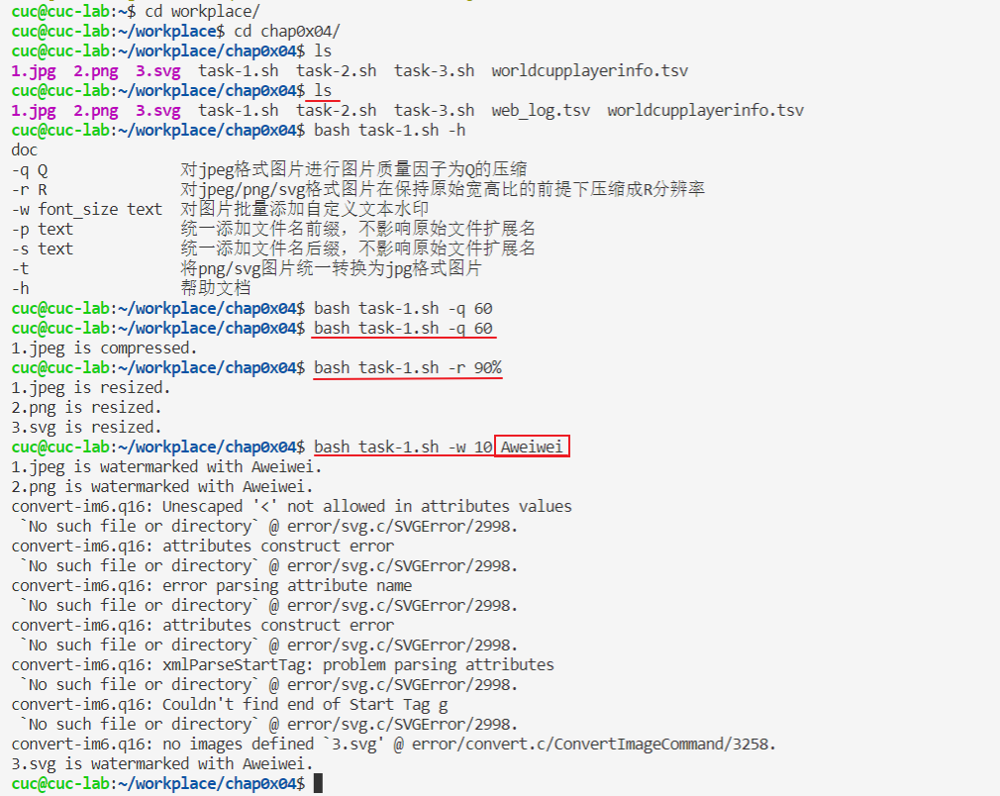
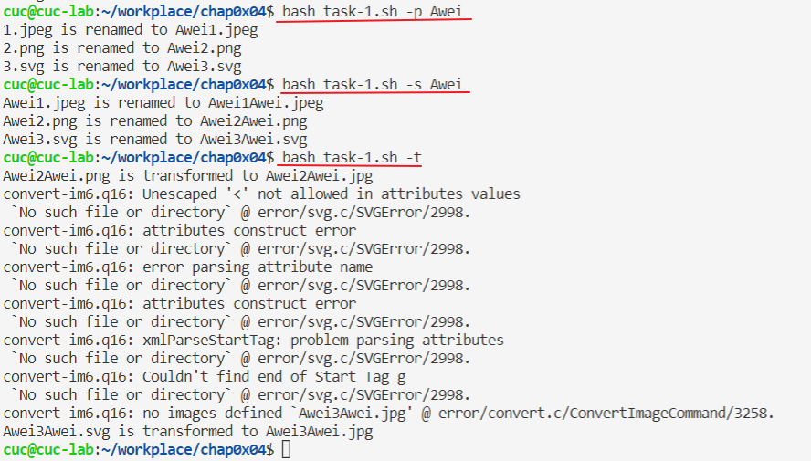
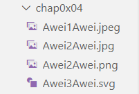
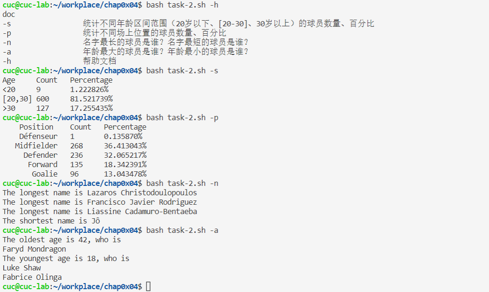
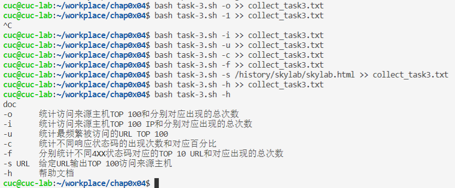
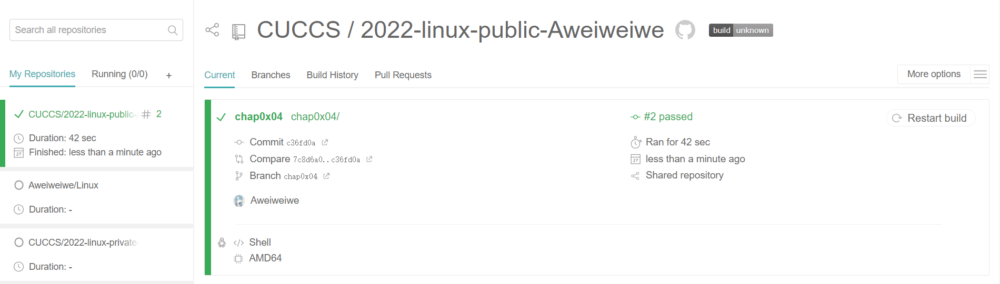

# 第四章：shell脚本编程基础（实验）

------

## 实验目的

- 熟悉`shell脚本`的编写，学会使用`shell脚本编程`的基本语法
- 熟悉`imagemagick`工具中`convert`命令的使用
- 学会构造`.travis.yml`配置文件，了解`Travis CI`系统

## 实验环境

- VirtualBox 6.1.16
- Ubuntu 20.04.02 Server 64bit
- Travis CI
- VsCode

## 实验要求

### 任务一：用bash编写一个图片批处理脚本，实现以下功能：

- ☑️支持命令行参数方式使用不同功能
- ☑️支持对指定目录下所有支持格式的图片文件进行批处理指定目录进行批处理
- ☑️支持以下常见图片批处理功能的单独使用或组合使用
  - ☑️支持对jpeg格式图片进行图片质量压缩
  - ☑️支持对jpeg/png/svg格式图片在保持原始宽高比的前提下压缩分辨率
  - ☑️支持对图片批量添加自定义文本水印
  - ☑️支持批量重命名（统一添加文件名前缀或后缀，不影响原始文件扩展名）
  - ☑️支持将png/svg图片统一转换为jpg格式

### 任务二：用bash编写一个文本批处理脚本，对以下附件分别进行批量处理完成相应的数据统计任务：

- ☑️统计不同年龄区间范围（20岁以下、[20-30]、30岁以上）的球员数量、百分比
- ☑️统计不同场上位置的球员数量、百分比
- ☑️名字最长的球员是谁？名字最短的球员是谁？
- ☑️年龄最大的球员是谁？年龄最小的球员是谁？

### 任务三：用bash编写一个文本批处理脚本，对以下附件分别进行批量处理完成相应的数据统计任务：

- ☑️统计访问来源主机TOP 100和分别对应出现的总次数
- ☑️统计访问来源主机TOP 100 IP和分别对应出现的总次数
- ☑️统计最频繁被访问的URL TOP 100
- ☑️统计不同响应状态码的出现次数和对应百分比
- ☑️分别统计不同4XX状态码对应的TOP 10 URL和对应出现的总次数
- ☑️给定URL输出TOP 100访问来源主机

### 报告要求：

- 继承[第一章：Linux基础（实验）](https://c4pr1c3.github.io/LinuxSysAdmin/chap0x01.exp.md.html)的所有实验报告要求
- 上述任务的所有源代码文件必须单独提交并提供详细的**–help**脚本内置帮助信息
- 任务二的所有统计数据结果要求写入独立实验报告

## 实验过程

### 任务一：用bash编写一个图片批处理脚本，实现批量处理图像

**实验前准备：**

- 安装`imagemagick`
- 学习使用`convert`命令：

```bash
#质量压缩
 convert -quality {width}x{height} {图片路径} {缩放后的图片路径}

#缩放图片大小：
convert -resize {width}x{height} {图片路径} {缩放后的图片路径}

#添加水印
#把名为logo.gif的水印图标添加在原始图片（src.jpg）右下角，且水印的下边缘距原始图片10像素、右边缘距原始图片5像素
convert src.jpg logo.gif -gravity southeast -geometry +5+10 -composite dest.jpg

#图片格式转换：
convert  xxx.jpg  xxx.png      #将jpeg转成png文件 
convert  xxx.gif   xxx.bmp     #将gif转换成bmp图像 
convert  xxx.tiff  xxx.pcx   #将tiff转换成pcx图像 
```

**编写脚本：**

```bash
#!/usr/bin/env bash

# 帮助文档
function help {
    echo "doc"
    echo "-q Q               对jpeg格式图片进行图片质量因子为Q的压缩"
    echo "-r R               对jpeg/png/svg格式图片在保持原始宽高比的前提下压缩成R分辨率"
    echo "-w font_size text  对图片批量添加自定义文本水印"
    echo "-p text            统一添加文件名前缀，不影响原始文件扩展名"
    echo "-s text            统一添加文件名后缀，不影响原始文件扩展名"
    echo "-t                 将png/svg图片统一转换为jpg格式图片"
    echo "-h                 帮助文档"
}

# 对jpeg格式图片进行图片质量压缩
function compressQuality {
    Q=$1 # 质量因子 #$1表示添加到shell的第一个参数
    for i in *;do
        type=${i##*.} # 删除最后一个.及左边全部字符
        if [[ ${type} != "jpeg" ]]; then continue; fi;
        convert "${i}" -quality "${Q}" "${i}"
        echo "${i} is compressed."
    done
}

# 对jpeg/png/svg格式图片在保持原始宽高比的前提下压缩分辨率

function compressResolution {
    R=$1
    for i in *;do
        type=${i##*.}
        if [[ ${type} != "jpeg" && ${type} != "png" && ${type} != "svg" ]]; then continue; fi;
        convert "${i}" -resize "${R}" "${i}"
        echo "${i} is resized."
    done
}

# 对图片批量添加自定义文本水印

function watermark {
    for i in *;do
        type=${i##*.}
        if [[ ${type} != "jpeg" && ${type} != "png" && ${type} != "svg" ]]; then continue; fi;
        convert "${i}" -pointsize "$1" -fill black -gravity center -draw "text 10,10 '$2'" "${i}"
        echo "${i} is watermarked with $2."
    done
}

# 批量重命名（统一添加文件名前缀或后缀，不影响原始文件扩展名）

function prefix {
    for i in *;do
        type=${i##*.}
        if [[ ${type} != "jpeg" && ${type} != "png" && ${type} != "svg" ]]; then continue; fi;
        mv "${i}" "$1""${i}"
        echo "${i} is renamed to $1${i}"
    done
}
function suffix {
    for i in *;do
        type=${i##*.}
        if [[ ${type} != "jpeg" && ${type} != "png" && ${type} != "svg" ]]; then continue; fi;
        filename=${i%.*}$1"."${type}
        mv "${i}" "${filename}"
        echo "${i} is renamed to ${filename}"
    done
}

# 将png/svg图片统一转换为jpg格式图片

function transform2Jpg {
    for i in *;do
        type=${i##*.}
        if [[ ${type} != "png" && ${type} != "svg" ]]; then continue; fi;
        filename=${i%.*}".jpg"
        convert "${i}" "${filename}"
   	echo "${i} is transformed to ${filename}"
    done
}

while [ "$1" != "" ];do
case "$1" in
    "-q")
        compressQuality "$2"
        exit 0
        ;;
    "-r")
        compressResolution "$2"
        exit 0
        ;;
    "-w")
        watermark "$2" "$3"
        exit 0
        ;;
    "-p")
        prefix "$2"
        exit 0
        ;;
    "-s")
        suffix "$2"
        exit 0
        ;;
    "-t")
        transform2Jpg
        exit 0
        ;;
    "-h")
        help
        exit 0
        ;;
esac
done
```

**脚本测试：**





- 检查图像名前缀与后缀：



### 任务二：用bash编写一个文本批处理脚本，完成`worldcupplayerinfo.tsv`中数据统计任务

**实验准备：**

- 下载所需文件：

```bash
wget "https://c4pr1c3.gitee.io/linuxsysadmin/exp/chap0x04/worldcupplayerinfo.tsv"
```

**脚本编写：**

```bash
#!/usr/bin/env bash
function help {
    echo "doc"
    echo "-s                 统计不同年龄区间范围（20岁以下、[20-30]、30岁以上）的球员数量、百分比"
    echo "-p                 统计不同场上位置的球员数量、百分比"
    echo "-n                 名字最长的球员是谁？名字最短的球员是谁？"
    echo "-a                 年龄最大的球员是谁？年龄最小的球员是谁？"
    echo "-h                 帮助文档"
}

# 统计不同年龄区间范围（20岁以下、[20-30]、30岁以上）的球员数量、百分比
function countAge {
	#指定输入文件折分隔符 \t
    awk -F "\t" '
        BEGIN {a=0; b=0; c=0;}
        $6!="Age" {
            if($6>=0&&$6<20) {a++;}
            else if($6<=30) {b++;}
            else {c++;}
        }
        END {
            sum=a+b+c;
            printf("Age\tCount\tPercentage\n");
            printf("<20\t%d\t%f%%\n",a,a*100.0/sum);
            printf("[20,30]\t%d\t%f%%\n",b,b*100.0/sum);
            printf(">30\t%d\t%f%%\n",c,c*100.0/sum);
        }' worldcupplayerinfo.tsv
}

# 统计不同场上位置的球员数量、百分比
function countPosition {
    awk -F "\t" '
        BEGIN {sum=0}
        $5!="Position" {
            pos[$5]++;
            sum++;
        }
        END {
            printf("    Position\tCount\tPercentage\n");
            for(i in pos) {
                printf("%13s\t%d\t%f%%\n",i,pos[i],pos[i]*100.0/sum);
            }
        }' worldcupplayerinfo.tsv
}

# 名字最长的球员是谁？名字最短的球员是谁？
# 考虑并列
function maxName {
    awk -F "\t" '
        BEGIN {mx=-1; mi=1000;}
        $9!="Player" {
            len=length($9);
            names[$9]=len;
            mx=len>mx?len:mx;
            mi=len<mi?len:mi;
        }
        END {
            for(i in names) {
                if(names[i]==mx) {
                    printf("The longest name is %s\n", i);
                } else  if(names[i]==mi) {
                    printf("The shortest name is %s\n", i);
                }
            }
        }' worldcupplayerinfo.tsv
}

# 年龄最大的球员是谁？年龄最小的球员是谁？
# 考虑并列
function maxAge {
    awk -F "\t" '
        BEGIN {mx=-1; mi=1000;}
        NR>1 {
            age=$6;
            names[$9]=age;
            mx=age>mx?age:mx;
            mi=age<mi?age:mi;
        }
        END {
            printf("The oldest age is %d, who is\n", mx);
            for(i in names) {
                if(names[i]==mx) { printf("%s\n", i); }
            }
            printf("The youngest age is %d, who is\n", mi);
            for(i in names) {
                if(names[i]==mi) { printf("%s\n", i); }
            }
        }' worldcupplayerinfo.tsv
}


while [ "$1" != "" ];do
    case "$1" in
        "-s")
            countAge
            exit 0
            ;;
        "-p")
            countPosition
            exit 0
            ;;
        "-n")
            maxName
            exit 0
            ;;
        "-a")
            maxAge
            exit 0
            ;;
        "-h")
            help
            exit 0
            ;;
    esac
done
```

**脚本测试：**



### 任务三：用bash编写一个文本批处理脚本，完成`web_log.tsv`中数据统计任务

**实验准备：**

- 安装`p7zip-full`
- 将所需文件下载到本地并解压

```bash
wget "https://c4pr1c3.gitee.io/linuxsysadmin/exp/chap0x04/worldcupplayerinfo.tsv"
7z x web_log.tsv.7z
```

**脚本编写：**

```bash
#!/usr/bin/env bash

function help {
    echo "doc"
    echo "-o      统计访问来源主机TOP 100和分别对应出现的总次数"
    echo "-i      统计访问来源主机TOP 100 IP和分别对应出现的总次数"
    echo "-u      统计最频繁被访问的URL TOP 100"
    echo "-c      统计不同响应状态码的出现次数和对应百分比"
    echo "-f      分别统计不同4XX状态码对应的TOP 10 URL和对应出现的总次数"
    echo "-s URL  给定URL输出TOP 100访问来源主机"
    echo "-h      帮助文档"
}

# 统计访问来源主机TOP 100和分别对应出现的总次数
function top100_host {
    printf "%40s\t%s\n" "TOP100_host" "count"
    awk -F "\t" '
    NR>1 {host[$1]++;}
    END { for(i in host) {printf("%40s\t%d\n",i,host[i]);} }
    ' web_log.tsv | sort -g -k 2 -r | head -100
}
# 统计访问来源主机TOP 100 IP和分别对应出现的总次数
function top100_IP {
    printf "%20s\t%s\n" "TOP100_IP" "count"
    awk -F "\t" '
    NR>1 {if(match($1, /^[0-9]{1,3}\.[0-9]{1,3}\.[0-9]{1,3}\.[0-9]{1,3}$/)) ip[$1]++;}
    END { for(i in ip) {printf("%20s\t%d\n",i,ip[i]);} }
    ' web_log.tsv | sort -g -k 2 -r | head -100
}
# 统计最频繁被访问的URL TOP 100
function top100_URL {
    printf "%55s\t%s\n" "TOP100_URL" "count"
    awk -F "\t" '
    NR>1 {url[$5]++;}
    END { for(i in url) {printf("%55s\t%d\n",i,url[i]);} }
    ' web_log.tsv | sort -g -k 2 -r | head -100
}
# 统计不同响应状态码的出现次数和对应百分比
function stateCode {
    awk -F "\t" '
    BEGIN {printf("code\tcount\tpercentage\n");}
    NR>1 {code[$6]++;}
    END { for(i in code) {printf("%d\t%d\t%f%%\n",i,code[i],100.0*code[i]/(NR-1));} }
    ' web_log.tsv
}
# 分别统计不同4XX状态码对应的TOP 10 URL和对应出现的总次数
function stateCode4 {
    printf "%55s\t%s\n" "code=403 URL" "count"
    awk -F "\t" '
    NR>1 { if($6=="403") code[$5]++;}
    END { for(i in code) {printf("%55s\t%d\n",i,code[i]);} }
    ' web_log.tsv | sort -g -k 2 -r | head -10

    printf "%55s\t%s\n" "code=404 URL" "count"
    awk -F "\t" '
    NR>1 { if($6=="404") code[$5]++;}
    END { for(i in code) {printf("%55s\t%d\n",i,code[i]);;} }
    ' web_log.tsv | sort -g -k 2 -r | head -10
}
# 给定URL输出TOP 100访问来源主机
function specificURL {
    printf "%40s\t%s\n" "TOP100_host" "count"
    awk -F "\t" '
    NR>1 {if("'"$1"'"==$5) {host[$1]++;} }
    END { for(i in host) {printf("%40s\t%d\n",i,host[i]);} }
    ' web_log.tsv | sort -g -k 2 -r | head -100
}
while [ "$1" != "" ];do
    case "$1" in
       "-o")
      top100_host
      exit 0
      ;;
       "-i")
      top100_IP
      exit 0
      ;;
       "-u")
      top100_URL
      exit 0
      ;;
       "-c")
      stateCode
      exit 0
      ;; 
       "-f")
      stateCode4
      exit 0
      ;;
       "-s")
      specificURL "$2"
      exit 0
      ;;
       "-h")
      help
      exit 0
      ;;
    esac
done
```

**脚本测试：**



### [我的Travis](“https://app.travis-ci.com/github/CUCCS/2022-linux-public-Aweiweiwe”)：



## 实验中遇到的问题及解决方法

- `Travis CI`系统在执行`.travis.yml`文件时出现`No such file or directory`的报错

  **解决方法：**`travis` 的测试执行环境中脚本执行的 `工作目录` 与`.travis.yml`所在的目录不符，在`.travis.yml`文件中`cd`到`shell脚本`所在的目录即可

- 对`.travis.yml`配置文件的用法与作用不了解，导致无法下手做实验
  
  **解决方法：**再次仔细看黄玮老师的视频、查看同学们在畅课讨论区的提问与经验帖分享、询问同学、参考官方文档、参考师哥师姐的公开仓库，终于大致把它弄懂了
  
- 一开始直接下载了任务二、三的`.tsv`数据文件，在`.travis.yml`文件中没有写上自动下载数据文件的代码，导致出现错误
  
  **解决方法：**在文件中添加`wget "https://c4pr1c3.gitee.io/linuxsysadmin/exp/chap0x04/worldcupplayerinfo.tsv"`和`wget "https://c4pr1c3.gitee.io/linuxsysadmin/exp/chap0x04/worldcupplayerinfo.tsv"`两段代码
  
- 思考如何将虚拟机里的文件上传到github上

  **两种解决方法：**

  - 使用`scp`命令将文件从虚拟机传送到宿主机中再上传
  - 直接在虚拟机中配置`git`

## 参考资料

- [Linux第四章课件](https://c4pr1c3.github.io/LinuxSysAdmin/chap0x04.md.html)
- [持续集成服务Travis CI 教程 - 阮一峰](http://www.ruanyifeng.com/blog/2017/12/travis_ci_tutorial.html)
- [Travis CI User Documentation](https://docs.travis-ci.com/)
- [shell脚本编程基础| 烏巢](https://hejueyun.github.io/posts/48ec4ca9/)
- 参考了以下师哥or师姐的公开仓库进行`shell脚本`与`travis.yml`配置文件的完善
  - https://github.com/CUCCS/2021-linux-public-Stephaniesuu/pull/4/
  - https://github.com/CUCCS/linux-2020-zhsss/pull/5

